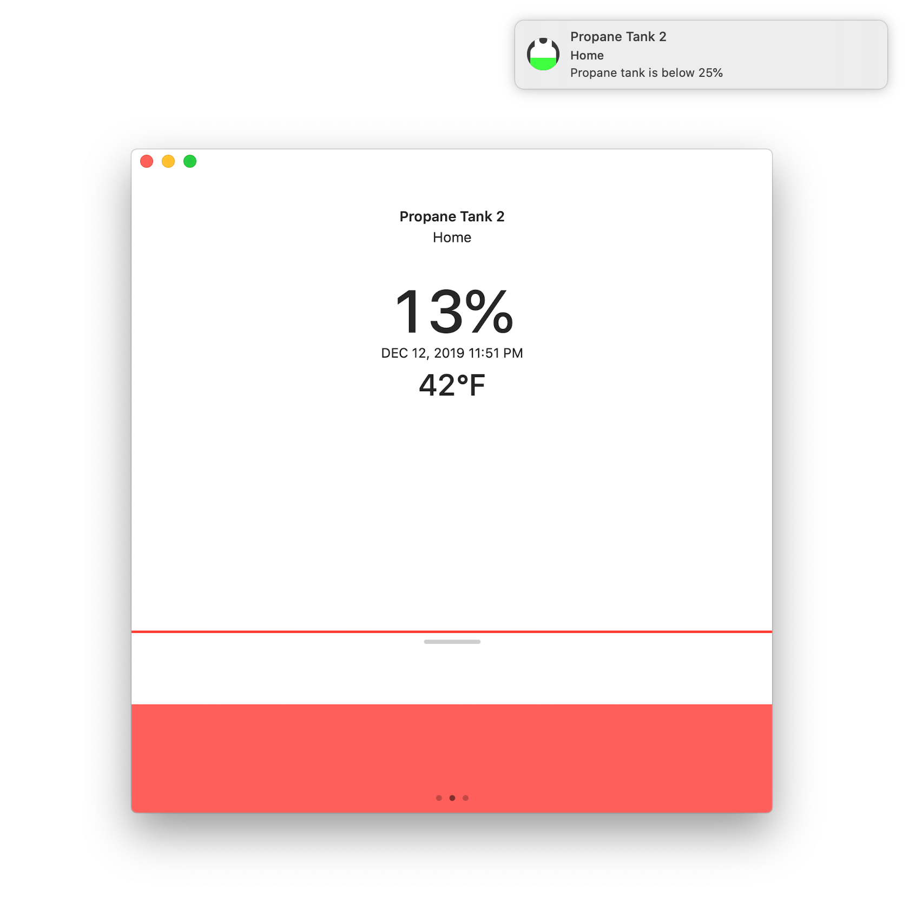

# Tanktop

Tanktop is an easy way to keep track of your [Tank Utility](https://www.tankutility.com)-monitored oil or propane tanks from an iPhone or iPad. Includes adjustable tank level notifications and a watch app with complications for Infograph and Infograph Modular watch faces.

Tanktop is useless without a Tank Utility monitor, which can be [purchased online](https://shop.tankutility.com) and connected to any [remote-ready R3D tank gauge.](http://www.tankutility.com/r3d-compatible-gauge-faces) To simply try out Tanktop's functionality with some example devices, authorize Tanktop with the email address `tankutility@example.com` and any non-empty password.

## Tanktop for Mac

Thanks to the magic of [Catalyst](https://developer.apple.com/mac-catalyst), Tanktop is now a mediocre Mac app!

## `TankUtility`

Tanktop depends on the included [`TankUtility`](TankUtility) Swift package, which wraps the [Tank Utility API.](http://apidocs.tankutility.com) 

## Requirements

Targets [iOS](https://developer.apple.com/ios)/[iPadOS](https://developer.apple.com/ipad)/[tvOS ](https://developer.apple.com/tvos) 13, as well as [watchOS](https://developer.apple.com/watchos) 6 and [macOS](https://developer.apple.com/macos) 10.15 Catalina.

Written in [Swift](https://developer.apple.com/documentation/swift) 5.1 using the [Foundation](https://developer.apple.com/documentation/foundation), [UIKit](https://developer.apple.com/documentation/uikit) and [WatchKit](https://developer.apple.com/documentation/watchkit) frameworks and requires [Xcode](https://developer.apple.com/xcode) 11 or newer to build.
