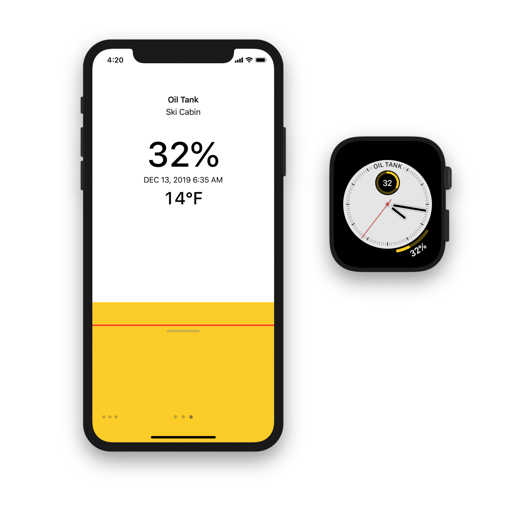

# Tanktop

Tanktop is an easy way to keep track of your [Tank Utility](https://www.tankutility.com)-monitored oil or propane tank(s) from an iPhone or iPad. Includes adjustable tank level notifications and a watch app with complications for Infograph and Infograph Modular watch faces.

If you don’t have a Tank Utility monitor for your oil or propane tank — or you don’t have an oil or propane tank at all — this app is completely useless to you. However, there is an example account that you can view using the email address `tanktop@example.com` and any non-empty string as a password.

## `TankUtility`

Tanktop relies on the included [`TankUtility`](TankUtility) Swift package, which wraps the [Tank Utility API.](http://apidocs.tankutility.com) 

## Requirements

Targets [iOS](https://developer.apple.com/ios)/[iPadOS](https://developer.apple.com/ipad)/[tvOS ](https://developer.apple.com/tvos) 13, as well as [watchOS](https://developer.apple.com/watchos) 6 and [macOS](https://developer.apple.com/macos) 10.15 Catalina.

It's written in [Swift](https://developer.apple.com/documentation/swift) 5.1 using the [Foundation](https://developer.apple.com/documentation/foundation), [UIKit](https://developer.apple.com/documentation/uikit) and [WatchKit](https://developer.apple.com/documentation/watchkit) frameworks and requires [Xcode](https://developer.apple.com/xcode) 11 or newer to build.

Supports apps targeting [iOS](https://developer.apple.com/ios)/[iPadOS](https://developer.apple.com/ipad)/[tvOS ](https://developer.apple.com/tvos) 13, as well as [watchOS](https://developer.apple.com/watchos) 6 and [macOS](https://developer.apple.com/macos) 10.15 Catalina.

It's written in [Swift](https://developer.apple.com/documentation/swift) 5.1 using the [Foundation](https://developer.apple.com/documentation/foundation), [BackgroundTasks](https://developer.apple.com/documentation/backgroundtasks) and [WatchConnectivity](https://developer.apple.com/documentation/watchconnectivity) frameworks and requires [Xcode](https://developer.apple.com/xcode) 11 or newer to build.
